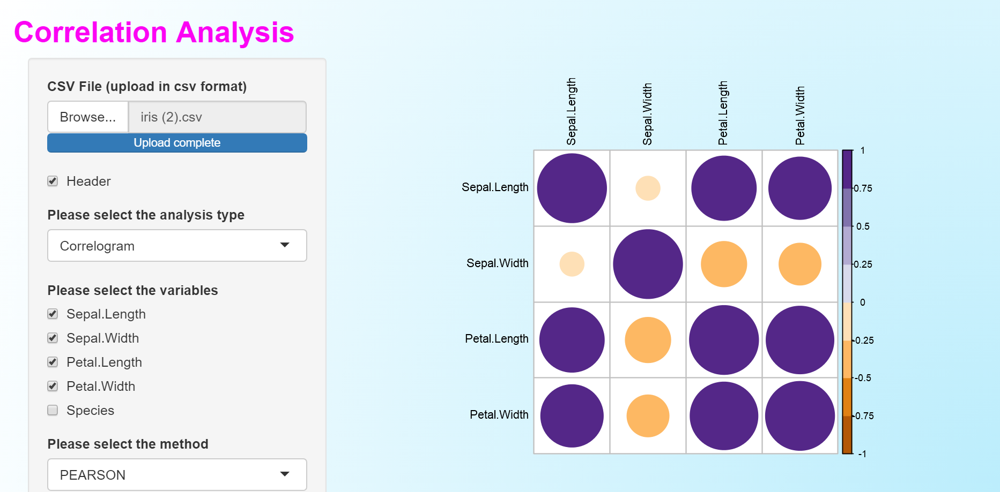
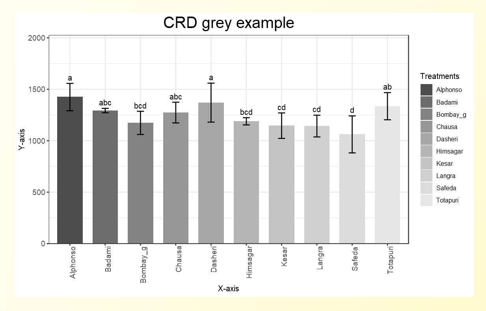
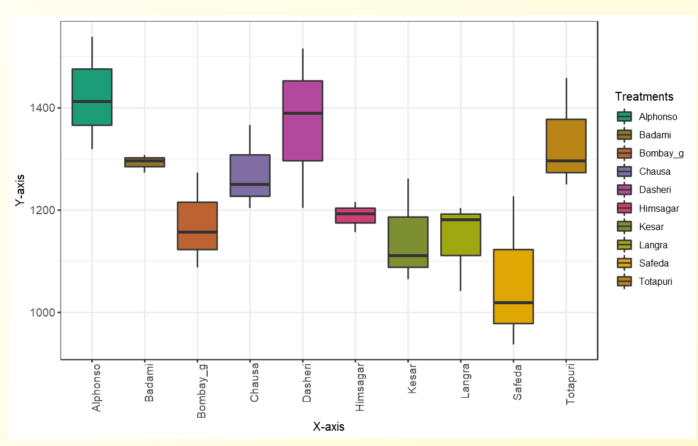
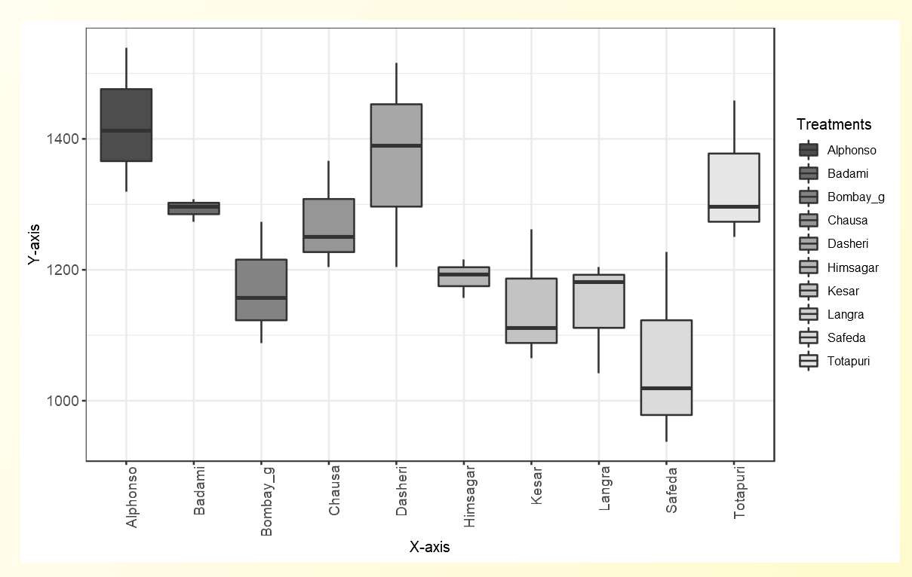
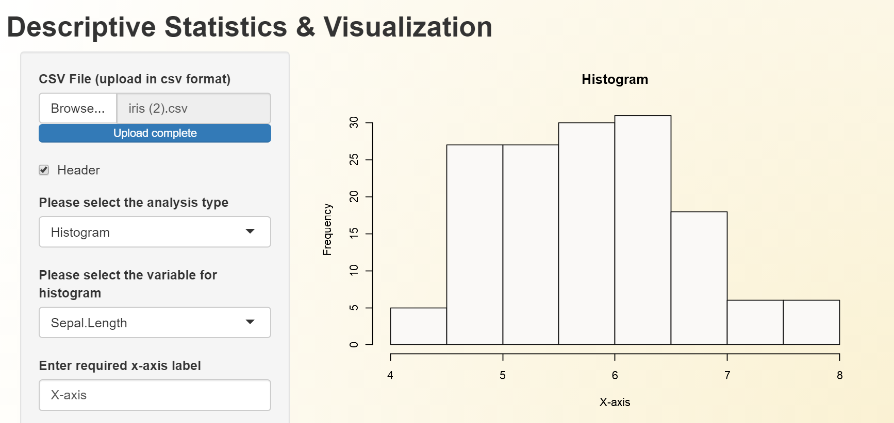
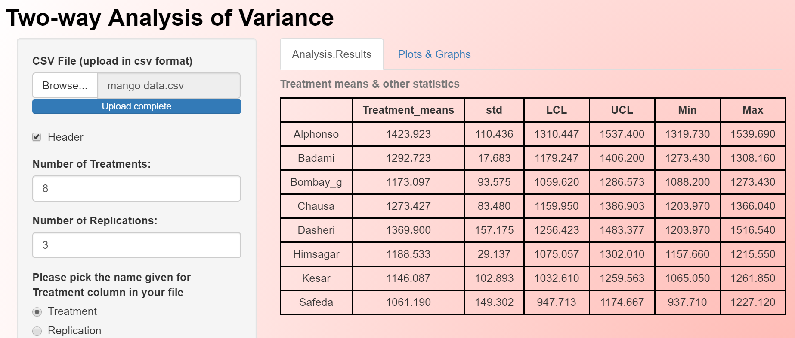
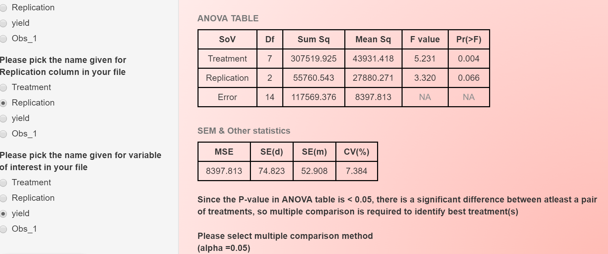
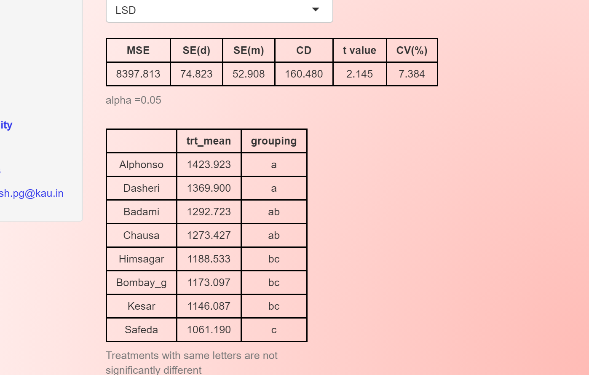

# `grapesAgri1`: Collection of shiny applications for data analysis in Agriculture-Part 1 
### General R-shiny based Analysis Platform Empowered by Statistics in Agriculture part-1 (grapesAgri1)

## R-Package for Data Analysis in Agriculture.
###### Version : 0.1.0; Copyright (C) 2021-2025: [Kerala Agricultural University](https://www.kaugrapes.com); License: [GPL-3](https://www.r-project.org/Licenses/) 

##### *Gopinath, P. P.<sup>1</sup>, Parsad, R.<sup>2</sup>, Joseph, B.<sup>1</sup>, Adarsh, V.S.<sup>3</sup>*

1.  Department of Agricultural Statistics, College of Agriculture, Vellayani, Kerala Agricultural Univesity.
2.  ICAR-Indian Agricultural Statistics Research Institute,
    New Delhi.
3.  Department of Agricultural Statistics, BCKV, West Bengal

---


[](https://cran.r-project.org/package=grapesAgri1)
[](https://doi.org/10.5281/zenodo.4923220)


[](https://github.com/pratheesh3780/grapesAgri1/actions)
[](https://cran.r-project.org/package=grapesAgri1)
[](https://www.travis-ci.com/pratheesh3780/grapesAgri1)
[](https://doi.org/10.21105/joss.03437)

---

## Introduction
<div align="justify">Agricultural experiments demands a wide range of statistical tools for analysis, which includes from Exploratory analysis, Design of experiments and Statistical genetics. Majority of the Agricultural scientists prefer graphical user interface for performing analysis . As R-shiny provides a platform to create interactive user interface, we have utilized it to produce interactive interfaces for commonly used analysis tools in Agrciultural experiments. grapesAgri1(General R-shiny based Analysis Platform Empowered by Statistics for data analysis in Agriculture-part1) is a collection of shiny based applications for some basic statistical analysis commonly used in agricultural research. It can be utilised by scientific community who prefers an interactive user interface. On using the functions in this package a Graphical User Interface will pop up. Apps Works by simple upload of files in CSV format. Results can be downloaded in HTML format. Plots and Graphs can be generated, which is also downloadable as .png file.</div>

## Installation
The package can be installed from CRAN as follows:

``` r
# Install from CRAN
install.packages('grapesAgri1', dependencies=TRUE)
```

The development version can be installed from github as follows:

``` r
# Install grapesAgri1 development version from Github using the code below:
if (!require('devtools')) install.packages('devtools')
devtools::install_github("pratheesh3780/grapesAgri1")
```

## usage
```r
grapesAgri1::descApp() # descriptive Statistics and Visualization 
grapesAgri1::corrApp() # Correlation Analysis
grapesAgri1::ttApp() # Compare Means
grapesAgri1::crdApp() # Completely Randomized Design
grapesAgri1::layoutApp() # Field layout of experiments
grapesAgri1::rbdApp() # Randomized Block Design 
```
## Apps included in the package

|Sl. No.| App Title | Function to call |Remark |
|:-----:| :----------- | :-----------:|:----------------|
|1|Descriptive Statistics and Visualization   | descApp()      |Summary Statistics, Summary Statistics by Group, Box plot, Histogram, Q-Q plot and Shapiro-Wilk's test|
|2|Correlation Analysis   | corrApp()      | Simple correlation, Correlation Matrix, correlogram and scatterplot|
|3|Compare Means: Small samle tests  | ttApp()      | One sample t-test, Two sample unpaired t-test, paired t-test, Two sample unpaired Welch t-test, F test, Box plot, Paired Plot|
|4|Completely Randomized Design  | crdApp()      |One-way Analysis of variance (equal and unequal replication), Multiple comparison test, boxplot and barchart with confidence interval|
|5|Field layout of experiments | layoutApp()      |Field layout of following designs can be obtained: Completely Randomized Design (CRD), Randomized Complete Block Design (RCBD), Split-plot design, Strip-plot design, Augmented RCBD|
|6|Randomized Block Design  | rbdApp()      |Two-way Analysis of variance, Multiple comparison test, boxplot and barchart with confidence interval|

## Further Reading
To know more about analysis tools included in the package see the following links
1. [Design and Analysis of experiments](http://apps.iasri.res.in/ebook/EBADAT/2-Basic%20Statistical%20Techniques/9-Fundamentals%20Of%20Designsf.pdf).
2. [Correlation Analysis](http://apps.iasri.res.in/ebook/EBADAT/2-Basic%20Statistical%20Techniques/6-Correlation_and_regression.pdf).
3. [Hypothesis Testing](http://apps.iasri.res.in/ebook/EBADAT/2-Basic%20Statistical%20Techniques/4-TEST%20OF%20HYPOTHESIS.pdf).
4. [Descriptive statistics and Exploratory data analysis](http://apps.iasri.res.in/ebook/EBADAT/2-Basic%20Statistical%20Techniques/1-Descriptive%20Statistics.pdf).
5. [Test for significance](http://apps.iasri.res.in/ebook/EBADAT/2-Basic%20Statistical%20Techniques/5-Tests%20of%20Significance-Seema.pdf).

## Glimpse to grapesAgri1 in Action!
It is very user friendly. Just upload your file in CSV format.

Note: we apologize that in grapesAgri1 version 1.0.0 in CRAN you may not be able to download model data set in crdApp()and rbdApp(). Issue will be cleared in the version 1.1.0 releasing by next month. You can instead download from github where the issue is resolved. 

Thank You

See below for some random images of GUI of grapesAgri1

 



  
















# Community guidelines

Report Issues:

-   Questions, feedback, bug reports: please open an issue in the [issue tracker of the project](https://github.com/pratheesh3780/grapesAgri1/issues).

Contribution to the software:

-   Please open an issue in the issue tracker of the project that describes the changes you would like to make to the software and open a pull request with the changes. The description of the pull request must reference the corresponding issue.

