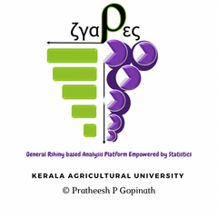

# `grapes`: Collection of shiny applications for data analysis in Agriculture 
## General Rshiny based Analysis Platform Empowered by Statistics (GRAPES)
###### Version : 0.1.0; Copyright (C) 2020-2021: [Pratheesh P. Gopinath](https://www.coagrapes.com); License: [GPL-3](https://www.r-project.org/Licenses/)
##### *Gopinath, P. P.<sup>1</sup>, Parsad, R.<sup>2</sup>, Joseph, B.<sup>3</sup>, Adarsh, V.S.<sup>4</sup>*

1.  Department of Agricultural Statistics, College of Agriculture, Vellayani, Kerala Agricultural Univesity.
2.  ICAR-Indian Agricultural Statistics Research Institute,
    New Delhi.
3.  Department of Agricultural Statistics, College of Agriculture, Vellayani, Kerala Agricultural Univesity.
4.  Department of Agricultural Statistics, BCKV, West Bengal

-----
[](https://www.gnu.org/licenses/gpl-3.0)


-----

## Introduction
Agricultural experiments demands a wide range of statistical tools for analysis, which includes from Exploratory analysis, Design of experiments and Statistical genetics. Majority of the Agricutural scientists prefer graphical user interface for performing analysis . As Rshiny provides a platform to create intercative user interface, we have utilzed it to produce interactive interfaces for commonly used analysis tools in Agrciultural experiments. GRAPES (General Rshiny based Analysis Platform Empowered by Statistics) is a collection of shiny based applications that can be utilised by scientific community who prefers an interactive user interface. On using the functions in this package a Graphical User Interface will pop up. Apps Works by simple upload of files in CSV format. Results can be downloaded as word file or HTML file. Plots and Graphs can be generated, which is also downloadable as .png file.
## Installation
The development version can be installed from github as follows:

``` r
# Install grapes development version from Github using the code below:
if (!require('devtools')) install.packages('devtools')
devtools::install_github("pratheesh3780/grapes")
```
## Apps included in the package

|Sl. No.| App Title | Function to call |Remark |
|:-----:| :----------- | :-----------:|:----------------|
|1|Descriptive Statistics and Visualization   | descAPP()      |Summary Statistics, Summary Statistics by Group, Box plot, Histogram, Q-Q plot and Shapiro-Wilk's test|
|2|Correlation Analysis   | corrApp()      | Simple correlation, Correlation Matrix, correlogram and scatterplot|
|3|Compare Means: Small samle tests  | ttApp()      | One sample t-test, Two sample unpaired t-test, paired t-test, Two sample unpaired Welch t-test, F test, Box plot, Paired Plot|
|4|Completely Randomized Design  | crdApp()      |One-way Analysis of variance (equal and unequal replication, Multiple comparison test), boxplot and barchart with confidence interval|
